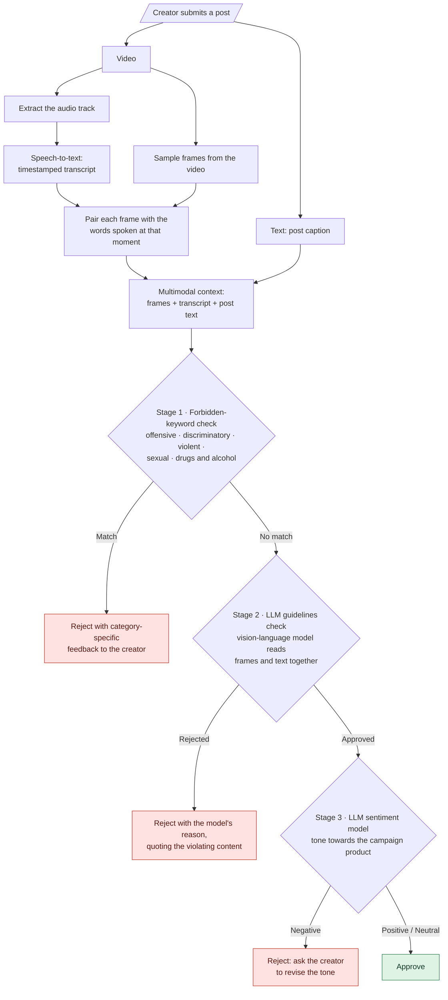

# AI/ML Engineer: CanopyLAB / Ganax.com / Pavoreal.AI

Jan 2024 – Jan 2025. Industry work, so the code is proprietary and not shared here.

## Content moderation for a social media platform ([ganax.com](https://ganax.com))

- **LLM-based video approval/rejection.** Samples video frames and transcribes the audio, then uses an LLM to
  detect terms-and-conditions violations before content goes live.
- **LLM-aided text approval/rejection.** Detects banned keywords, limits hashtag misuse, analyses sentiment and
  checks posts against platform policies. Developed and deployed.
- **LLM-based sentiment analysis.** Switches dynamically between a fine-tuned model and a RAG-integrated model.
  Reached about 80% accuracy and a quadratic weighted kappa of 0.70–0.75 on real-world data. Used in the
  content approval/rejection pipeline.

### How the approval pipeline works

Video, audio and text all go through the same pipeline. Video is split into frames and audio is transcribed;
text from the post goes straight into the checks.

- **Cheapest checks run first.** The keyword check is near-instant and free. The LLM checks only run if
  the content passes it, and sentiment only runs if the guidelines check approves, which keeps model costs down.
- **Every rejection is explained.** The creator gets a message that says why the post was rejected and what to
  change. The guidelines check returns structured output, a decision plus a reason that quotes the evidence.
- **What is seen, said and written is checked together.** Frames are paired with the transcript of the same
  moment and combined with the post text, so the LLM judges the whole post at once.

## Conversational and agentic systems

- **Recommendation and support chatbot (ganax.com).** LLM chatbot built on an agent framework, with tools for
  personalised recommendations, Q&A and FAQs.
- **Automated qualitative feedback (CanopyLAB).** LLM chatbot built on an agent framework that processes
  qualitative feedback on an e-learning platform. Developed and deployed.
- **Natural language to SQL (Pavoreal.AI).** Fine-tuned an LLM chatbot to turn natural-language questions into
  SQL queries over Snowflake databases.

## Forecasting

- **Multivariate time-series forecasting (Pavoreal.AI).** Neural network built and optimised in TensorFlow,
  designed to plug into LLM-driven agentic workflows.
