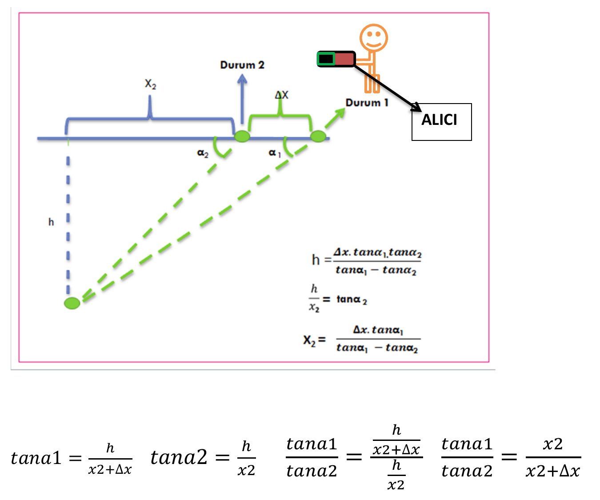

# Patent Application: Ultrasonic Transceiver for Locating People Trapped Under Debris

Turkish Patent and Trademark Office, Sep 2013 – May 2014. Co-inventor and applicant. The application
passed the formal examination and was not pursued to grant. The original Turkish text is followed by an English translation.

**ENKAZ ALTINDA KALAN İNSAN BEDENLERİNİN KONUMUNUN TESPİTİ İÇİN ULTRASONİK SES DALGALARI KULLANAN BİR ALICI VERİCİ MEKANİZMASI**

## Şekil 1

## Özet

Enkaz altında kalan bedenlerin yerinin tayini için geliştirilmiş bir mekanizma olup alıcı ve verici adını verdiğimizi iki kısımdan oluşmaktadır. Verici; günlük hayatta kullanılan herhangi bir aksesuara veya iç çamaşırına yerleştirilebilecek boyutta olan, belirli periyotlarla ultrasonik ses sinyali yayan, basınca ve suya dayanıklı malzemeden yapılmış, kişisel tercihe bağlı olarak sıcaklık sensörü veya nabız ölçer içeren ve alıcıdan gelen aktifleştirici sinyalleri algılayan bir mekanizmadır. Alıcı ise arama kurtarma yapan kişilerde bulunan, enkaz altındaki vericileri aktifleştirecek sinyaller yayan, vericilerin konumunun daha kesin tayinin yapılabilmesi için bir çanak anten içeren, parazitleri önlemek için amplifikatör kısmında parazit filtresi bulunan bir cihazdır.

## İstemler

1. Buluş, enkaz altında kalmış insan bedenlerinin yerinin tespitini yapan geliştirilmiş bir alıcı verici mekanizması olup, özelliği; mekanizmanın ultrasonik ses dalgaları yayan taşınabilir bir verici ve bunu algılayan bir alıcı içermesi; söz konusu alıcının enkaz altında birden fazla verici olabilmesi durumunda odak noktasına ses algılayıcısı yerleştirilmiş bir çanak anten sayesinde verimli sonuç alabilmesi; vericinin enkaz altındaki insan bedenin canlı mı yoksa ölü mü olduğunu ayırt eden bir nabız ölçer veya sıcaklık sensörüne  sahip olmasıdır.

2. İstem 1’e göre, doğal afetler sonucu enkaz altında kalmış insan bedenlerinin yerinin tespitini yapan geliştirilmiş bir alıcı verici mekanizması olup, özelliği; insan vücudu üzerinde herhangi bir yere yerleştirilebilmesi veya bir aksesuara, iç çamaşırına yerleştirilebilmesi; insan vücudu üzerinde olacağından vücut sıvısından etkilenebileceği için suya dayanıklı malzemeden yapılması; enkaz altında zarar görebileceğinden dolayı basınca dayanıklı malzemeden yapılmasıdır.

3. İstem 1 veya 2’ye göre, doğal afetler sonucu enkaz altında kalmış insan bedenlerinin yerinin tespitini yapan geliştirilmiş bir alıcı verici mekanizması olup, özelliği; kişilerin sarsıntı esnasında sistemi aktifleştirememesi durumunda arama işlemi yapan kişilerin elinde bulunacak olan alıcı mekanizmasının, enkaz dışından alıcının menzili içerisindeki vericileri aktifleştirebilecek ayrı bir verici mekanizması içermesi, insan vücudu üzerinde bulunan verici mekanizmasının ise arama kurtarma ekibinde bulunacak olan verici mekanizmasından gelen sinyalleri algılayabilmesi için ayrı bir alıcı mekanizması içermesidir.

4. İstem 1, 2 veya 3’e göre, doğal afetler sonucu enkaz altında kalmış insan bedenlerinin yerinin tespitini yapan geliştirilmiş bir alıcı verici mekanizması olup, özelliği; belirli aralıkla ses sinyali yayarak enkaz altından gelebilecek  diğer ses sinyalleri ile karışmaması, canlı ve ölü bedenleri ayırt edebilmesi, daha yüksek desibel seviyesinde ses sinyali yayabilmesi ve pilden tasarruf sağlayabilecek olmasıdır.

5. 1-4’nolu istemlerin herhangi birisine göre, doğal afetler sonucu enkaz altında kalmış insan bedenlerinin yerinin tespitini yapan geliştirilmiş bir alıcı verici mekanizması olup, özelliği; enkaz altından gelebilecek, sistemde kullanılan ses sinyaline yakın sinyallerin oluşturduğu parazitleri önleyen alıcının bir parazit filtresi içermesidir.

---

# English translation

**A transceiver mechanism using ultrasonic sound waves to locate human bodies trapped under debris**

## Figure 1

*Labels in the figure:* **ALICI** = receiver, **Durum 1 / Durum 2** = position 1 / position 2,
**α₁, α₂** = receiver tilt angles at each position, **Δx** = distance walked between the two positions,
**x₂** = horizontal distance to the person, **h** = depth of the person below the surface.

## Abstract

A mechanism developed for locating bodies trapped under debris, made up of two parts that we call the receiver
and the transmitter. The transmitter is small enough to be placed in any everyday accessory or in underwear. It
emits an ultrasonic sound signal at set intervals, is made of pressure- and water-resistant material, contains a
temperature sensor or a pulse meter depending on personal preference, and detects activation signals sent by the
receiver. The receiver is a device carried by search-and-rescue personnel. It emits signals that activate the
transmitters under the debris, contains a parabolic dish antenna for locating the transmitters more precisely, and
has a noise filter in its amplifier stage to suppress interference.

## Claims

1. The invention is an improved receiver-transmitter mechanism for locating human bodies trapped under debris,
   characterised in that: the mechanism comprises a portable transmitter emitting ultrasonic sound waves and a
   receiver that detects it; the receiver can obtain efficient results, even when there are several transmitters
   under the debris, by means of a parabolic dish antenna with a sound sensor placed at its focal point; and the
   transmitter has a pulse meter or temperature sensor that distinguishes whether the person under the debris is
   alive or dead.

2. An improved receiver-transmitter mechanism according to Claim 1 for locating human bodies trapped under debris
   after natural disasters, characterised in that: it can be placed anywhere on the human body or inside an
   accessory or underwear; it is made of water-resistant material, since it will be on the body and may be exposed
   to body fluids; and it is made of pressure-resistant material, since it may be damaged under the debris.

3. An improved receiver-transmitter mechanism according to Claim 1 or 2 for locating human bodies trapped under
   debris after natural disasters, characterised in that: in case people cannot activate the system during the
   earthquake, the receiver held by the search team contains a separate transmitter that can activate, from outside
   the debris, the transmitters within the receiver's range; and the transmitter worn on the body contains a
   separate receiver so that it can detect the signals sent by the search-and-rescue team's transmitter.

4. An improved receiver-transmitter mechanism according to Claim 1, 2 or 3 for locating human bodies trapped under
   debris after natural disasters, characterised in that: by emitting a sound signal at set intervals it does not
   get mixed up with other sound signals that may come from under the debris; it can distinguish living from dead
   bodies; it can emit sound at a higher decibel level; and it saves battery power.

5. An improved receiver-transmitter mechanism according to any one of Claims 1–4 for locating human bodies
   trapped under debris after natural disasters, characterised in that the receiver contains a noise filter that
   suppresses interference from signals under the debris that are close to the sound signal used by the system.
