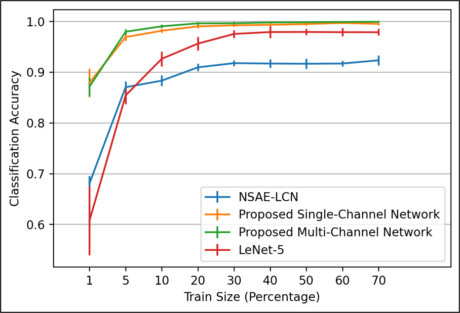

# Kerem Şahin

AI/ML Engineer with expertise in developing advanced machine learning and NLP solutions, including
LLM-based systems, sentiment analysis, time series forecasting and predictive maintenance. Proven track
record of improving user engagement and operational efficiency through innovative AI tools. Skilled in
Python, TensorFlow, and cloud technologies, with a passion for driving meaningful change through technology.

## Selected work

| Project | Type | Links |
|---|---|---|
| **Deep convolutional autoencoder for predictive maintenance**: fault classification from multi-channel bearing-vibration signals, 99.2% accuracy using only 5% of the data for training and 10× faster training than the NSAE-LCN baseline; co-developed from literature review to benchmarking | IEEE SIU 2022 paper · 1st Prize, VERİM Award · industry-supported graduation project (Çözüm Makina) | [Paper (DOI)](https://doi.org/10.1109/SIU55565.2022.9864836) |
| **Ultrasonic locator for people trapped under debris**: wearable 20 kHz beacon and directional receiver | Patent application (2013–2014), co-inventor and applicant; passed formal examination | — |
| **Microbolometer infrared camera module**: selected components for, designed (Altium), built and tested the power-board PCB, and generated the camera's synchronising clock signals on an FPGA programmed in Python, for an uncooled IR camera | Research project (SUMER, Sabancı Univ., 2018) | [Poster](posters/sumer-ir-camera-poster.pdf) |
| **ADS1148 16-bit ADC firmware for STM32**: bare-metal SPI driver with interrupt-driven sampling, precision voltage measurement | Industrial internship (Pavotek, 2019) | [Code](https://github.com/keremshns/ads1148-stm32-firmware) · [Poster](https://github.com/keremshns/ads1148-stm32-firmware/blob/main/docs/poster.pdf) |

### Predictive maintenance: accuracy vs. training-data size

Our single- and multi-channel networks stay above 97% accuracy with only 5% of the CWRU data used for
training, while a reimplemented LeNet-5 CNN and NSAE-LCN need far more data and plateau lower.

## Skills

Machine learning and NLP: LLM-based systems, sentiment analysis, time-series forecasting, deep learning ·
Python, TensorFlow, MATLAB, cloud platforms · Embedded and hardware: C for ARM Cortex-M (STM32),
FPGA (PYNQ), PCB design (Altium), signal processing
